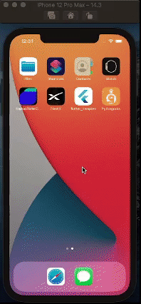

# FlashX

## Cross platform mobile app to get information about the next rocket launch, upcoming rocket launches and past rocket launches. SpaceX designs, manufactures and launches rockets and spacecraft.

  
### Running on real android device [as an application] & ios Emulator (iphone 12 pro max)

  
  <b style="word-space:2em">&nbsp;&nbsp;&nbsp;&nbsp;&nbsp;&nbsp;&nbsp;&nbsp;</b>

  

### Running on android
 

<video width="320" height="240" controls>
  <source src="readme-assets/android-showcase.mp4" type="video/mp4">
</video>

#### You can test it out through:

 - Downloading android apk from [here][apk]

[apk]: https://drive.google.com/file/d/1LuACmj2TtbQWU-e67zHeb1ysKC-gNCaL/view?usp=sharing
